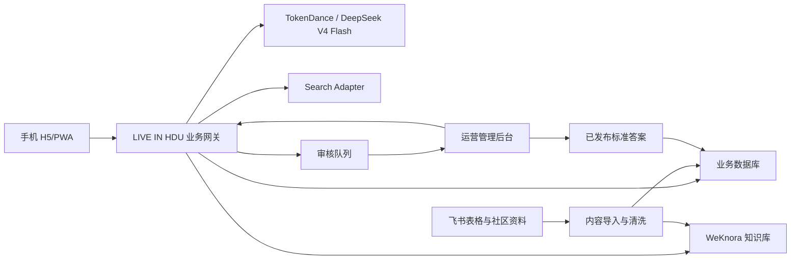
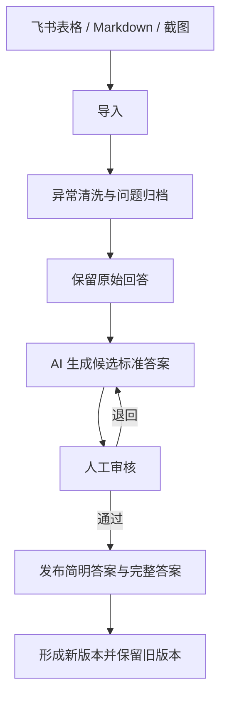
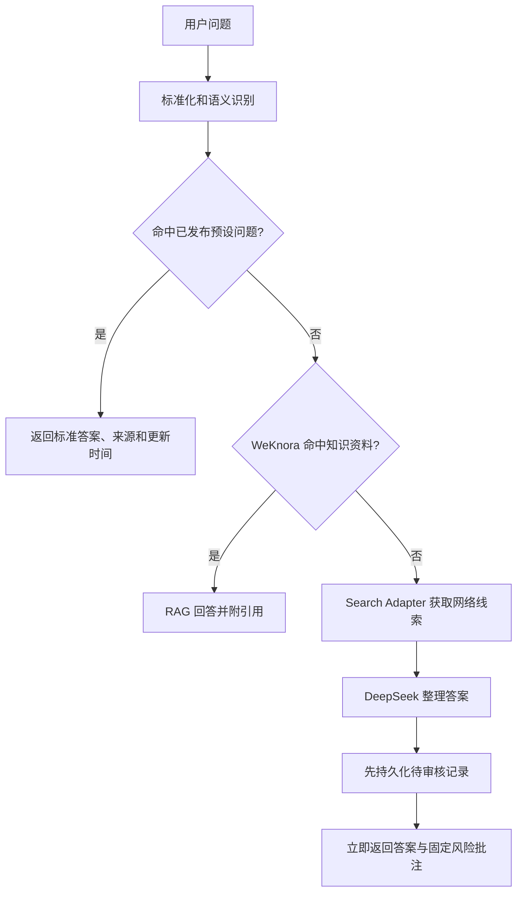

# LIVE IN HDU 本地知识智能体平台设计

日期：2026-07-28

## 1. 设计结论

本项目先在当前 Windows 电脑上完成本地部署和验收，首发用户端采用手机 H5/PWA，不把微信小程序审核放进本地首版关键路径。

系统采用可替换的分层架构：

- 用户端：Vue 3、TypeScript、Vite、TDesign Mobile。
- 管理端：Vue 3、TypeScript、Vite、TDesign Vue Next。
- 业务网关：Node.js、TypeScript、Fastify。
- 本地基础数据：第一阶段使用 Node.js 24 内置 `node:sqlite` 驱动的 SQLite，并通过 Repository 接口隔离；完整本地版迁移到 PostgreSQL。
- 知识库：WeKnora，通过 Docker Desktop、WSL2 和 Docker Compose 运行。
- 模型：通过 TokenDance 的 OpenAI 兼容 API 调用 `deepseek-v4-flash`。
- 联网搜索：独立 Search Adapter；TokenDance 只负责模型调用，不等同于搜索服务。
- 未来公网入口：Caddy HTTPS；本地阶段不对公网匿名开放。

当前问题数量不是程序常量。系统支持新增、停用、合并、排序任意数量的问题意图。

## 2. 当前条件

当前电脑具备约 32 GB 内存、24 核处理器、WSL2 和充足磁盘空间，可以运行完整本地容器栈。当前已安装 Node.js 24，但尚未安装 Docker Desktop。

当前飞书协作表实际包含 35 个问题，其中部分问题已有多份学长学姐回答。原始表内存在“回答（三）”批量出现 `19` 的异常数据，导入时必须识别并排除，不能作为正式回答。

用户已具备 TokenDance 约 200 元模型调用额度。额度只承担模型推理费用，不托管用户端、业务网关、数据库、知识库或审核队列。

本地运行时，电脑即服务器。电脑关机、休眠、断网或服务停止后，用户端不可用。迁移到云服务器后，本地电脑可以关机。

## 3. 目标与非目标

### 3.1 本地阶段目标

1. 将飞书表格中的问题和原始回答导入本地平台。
2. 保留原始回答，生成候选标准答案，经人工审核后发布。
3. 手机端直接逐页浏览高频问题及简明答案。
4. 支持用户自由提问，并完成预设答案、知识库、联网兜底三段路由。
5. 所有第三段问题进入持久化审核队列，管理员离线不阻塞用户回答。
6. 内容、问题数量、排序、模型和知识库连接均可配置。
7. 系统结构能够整体迁移到腾讯云，而不重写页面和业务规则。

### 3.2 本地阶段非目标

- 不提交微信小程序审核。
- 不建立公网长期服务。
- 不在本机运行 DeepSeek 模型或其他大型本地模型。
- 不实现复杂组织、多租户和收费系统。
- 不让未经审核的团队原始回答自动成为正式标准答案。
- 不把 WeKnora 管理界面直接暴露给匿名用户。

## 4. 总体架构

### 4.1 分层原则

业务网关拥有产品规则，WeKnora 只作为知识检索引擎。前端只调用业务网关，不直接调用 TokenDance、WeKnora 或数据库。

各外部能力都通过 Adapter 接口接入：

- `ModelProvider`：TokenDance，后续可切换其他模型平台。
- `KnowledgeProvider`：WeKnora，后续可更换 RAG 引擎。
- `SearchProvider`：联网搜索服务。
- `ContentImporter`：XLSX 手工导入，后续扩展飞书开放平台同步。
- `Repository`：阶段 A 使用 SQLite，阶段 B 使用 PostgreSQL；业务层不直接编写数据库专属语句。

## 5. 组件职责

### 5.1 用户端

负责高频问题浏览、答案展开、来源展示、自由提问、对话、反馈和阅读位置记忆。用户端不保存模型密钥，不判断内容可信度，不直接访问内部服务。

### 5.2 管理端

负责问题意图、原始回答、候选答案、标准答案、来源、发布状态、排序、审核队列、用户反馈、健康状态和测试结果。

### 5.3 业务网关

负责：

- 请求校验和限流；
- 问题标准化和语义意图判断；
- 三段问答路由；
- 标准答案版本控制；
- 风险批注；
- 审核记录持久化；
- TokenDance、WeKnora 和搜索服务调用；
- 统一返回来源和可信状态；
- 记录错误、延迟和调用量。

### 5.4 WeKnora

负责飞书社区文章、Markdown、PDF、网页等资料的解析、分块、检索和引用。WeKnora 的答案必须经过业务网关统一包装后再返回用户。

### 5.5 TokenDance

TokenDance 使用服务端环境变量中的 API Key，提供 `deepseek-v4-flash` 意图分类和答案整理能力。前端不得持有或调用该密钥。

### 5.6 Search Adapter

联网搜索与模型推理分离。Search Adapter 返回标题、摘要、URL、抓取时间和搜索状态，DeepSeek 只根据这些线索整理答案。搜索服务不可用时，系统进入明确降级模式，不伪造来源。

## 6. 核心数据模型

### 6.1 QuestionIntent

- 稳定 ID
- 问题分类
- 标准问题
- 意图说明
- 相似问法
- 关键词和排除词
- 是否启用
- 是否置顶
- 展示顺序
- 当前标准答案版本

### 6.2 RawAnswer

- 所属问题
- 原始回答正文
- 来源单元格或截图
- 回答者信息（存在时）
- 适用校区、年份和专业
- 导入时间
- 异常标记
- 是否参与候选答案生成

### 6.3 CanonicalAnswer

- 所属问题
- 80 至 150 字简明答案
- 完整答案
- 事实敏感项
- 来源列表
- 版本号
- 状态：草稿、待审核、已发布、需更新、已停用
- 审核人和审核时间
- 生效时间和更新时间

### 6.4 Source

- 来源类型：学校官方、LIVE IN HDU、学长学姐经验、联网来源
- 标题
- URL 或本地文件标识
- 发布/更新时间
- 适用范围
- 可信等级

### 6.5 ReviewTask

- 单调递增序号
- 用户原问题
- 系统临时回答
- 来源和路由信息
- 风险级别
- 创建时间
- 状态：待审核、已通过、已驳回、需补充
- 审核后答案
- 回流目标

### 6.6 Conversation 与 Feedback

保存对话上下文、当前问题卡来源、用户反馈类型、反馈时间和处理状态。首版不收集身份证号等敏感个人信息。

## 7. 内容整理与发布流程

导入过程必须：

1. 以稳定问题 ID 关联内容，而不是依赖行号。
2. 将空值、批量 `19` 等异常内容隔离。
3. 保留所有原始回答，禁止覆盖。
4. 标记年份、日期、费用、政策、比例、名额、私人电话号码等风险项。
5. 将共同结论、个体经验和冲突观点分开。
6. 只有人工确认后的 `published` 版本可以作为预设答案直接返回。

## 8. 用户问答路由

固定批注为：

> 该条回复并不在我们的知识库以及 40 个预设问题中，请注意甄别

此文案暂按原产品要求逐字保留。未来问题数量变化时，可以在不改变风险含义的前提下，由负责人决定是否将“40 个”改为“预设问题”。

系统不向用户返回“未收录”或类似拒绝性话术。管理员离线时，第三段答案仍正常返回并按创建时间进入审核队列。

## 9. 手机端页面设计

用户已确认采用逐页问答卡方案。

### 9.1 默认顺序

1. 前 10 张展示当前最重要、最常问的问题。
2. 其余问题按报到、宿舍、课程、专业、升学、安全等分类排列。
3. 排序由管理后台维护，不写死在前端。
4. 后期可根据点击和提问频率提供排序建议，但自动建议不能直接修改正式顺序。

### 9.2 问题卡

每张卡展示：

- 当前进度；
- 问题分类；
- 完整问题；
- 80 至 150 字简明答案；
- “展开完整回答”；
- 可信状态；
- 来源；
- 更新时间；
- 信息过时反馈入口；
- 上一题、下一题；
- 左右滑动翻页。

可信状态只展示用户可理解的标签：

- 已审核标准答案；
- 社区知识库；
- 联网整理·注意甄别。

不向普通用户展示检索分数和模型置信度。

### 9.3 全部问题目录

顶部提供“全部问题”，按分类展示所有启用问题并支持直接跳转。纯逐页浏览和快速定位同时存在。

### 9.4 自由提问

底部固定“没有解决我的问题，直接提问”。

点击后：

1. 底部弹出快速输入框。
2. 自动带入当前问题卡作为上下文。
3. 用户提交后进入全屏聊天页。
4. 返回问题卡时恢复原阅读位置。

## 10. 管理与运维

### 10.1 管理页面

- 数据概览
- 问题意图管理
- 原始回答管理
- 候选标准答案
- 发布与版本管理
- 未收录问题审核队列
- 知识库资料状态
- 用户反馈
- 服务健康与调用日志
- 系统配置

### 10.2 日常维护

- 定期导入新增飞书内容。
- 每日处理待审核问题。
- 高风险事实必须核对学校官方来源后才能进入正式答案。
- 对已发布答案设置更新时间和“需复核”状态。
- 保留修改历史，不覆盖旧版本。
- 统计预设命中率、知识库命中率、联网兜底率和用户反馈率。

### 10.3 本地启动与备份

- 提供统一启动、停止和健康检查脚本。
- 服务启动失败时指出具体组件，不静默失败。
- 本地数据库每日备份。
- PostgreSQL 阶段使用 `pg_dump` 备份。
- WeKnora 资料和配置单独备份。
- API Key 只保存在 `.env.local` 或系统环境变量中，不进入仓库。

## 11. 错误处理与降级

- TokenDance 超时：返回不包含虚构事实的降级指导，保留固定批注并入队。
- 搜索不可用：标记无联网来源，不伪造标题和 URL。
- WeKnora 不可用：继续尝试预设答案和第三段兜底。
- 数据库写入失败：第三段不得先返回成功再丢失审核记录。
- 答案版本损坏：继续使用最后一个已发布版本。
- 管理员离线：审核队列继续 FIFO 持久化。
- 重复提交：使用请求 ID 避免重复扣费和重复入队。

## 12. 安全边界

- TokenDance API Key 只在后端使用。
- 本地管理端默认只监听 `localhost`。
- 局域网用户只访问用户端和受控 API。
- 不直接开放 PostgreSQL、WeKnora 内部端口和管理接口。
- 日志脱敏手机号、密钥和用户输入中的敏感信息。
- 用户端提示不要输入身份证号等敏感信息。
- 公网部署前增加管理员登录、HTTPS、限流、防跨站请求和安全头。

## 13. 测试与验收

### 13.1 内容

- 当前表格问题全部可导入。
- 异常 `19` 不进入正式回答。
- 原始回答、候选答案、标准答案分层保存。
- 未审核答案不能以“已审核标准答案”返回。

### 13.2 用户端

- 所有启用问题均可逐页浏览。
- 前 10 题顺序可在后台调整。
- 简明答案、展开全文、来源和更新时间正确。
- 目录可跳转，返回后位置不丢失。
- 底部提问能带入当前问题上下文。
- 微信内置浏览器和常见手机尺寸可正常使用。

### 13.3 问答

- 每个已发布意图至少有 3 个语义改写测试。
- 预设、知识库、联网三条路由均有自动测试。
- 第三段 100% 带固定批注并生成持久化审核记录。
- TokenDance 或搜索服务异常时不阻塞整个系统。
- 管理员离线和服务重启后审核记录仍按时间排序。

### 13.4 运维

- 一条命令启动，一条命令停止。
- 健康检查能区分网关、数据库、WeKnora、TokenDance 和搜索服务。
- 备份可以恢复到一套干净环境。
- API Key 不出现在前端构建产物和日志中。

## 14. 分阶段落地

### 阶段 A：本地基础闭环

- 用户端逐页问题卡
- 管理端基础页面
- 业务网关
- 飞书 XLSX 导入
- 原始回答、候选答案和发布流程
- TokenDance 接入
- 审核队列
- SQLite 本地数据持久化
- SQLite 到 PostgreSQL 的迁移验收脚本

### 阶段 B：完整本地知识库

- 安装 Docker Desktop
- PostgreSQL
- WeKnora
- 飞书社区资料导入
- Search Adapter
- RAG 引用
- 完整健康检查、备份和降级测试

### 阶段 C：腾讯云迁移

- 上海地域 Lighthouse
- Docker Compose
- Caddy HTTPS
- 域名、ICP 和后续小程序备案
- 管理端鉴权、限流和公网安全

阶段 A 和阶段 B 使用相同接口、数据实体和页面，不建立一次性演示分支。迁移到阶段 C 时只替换运行环境和连接配置。
