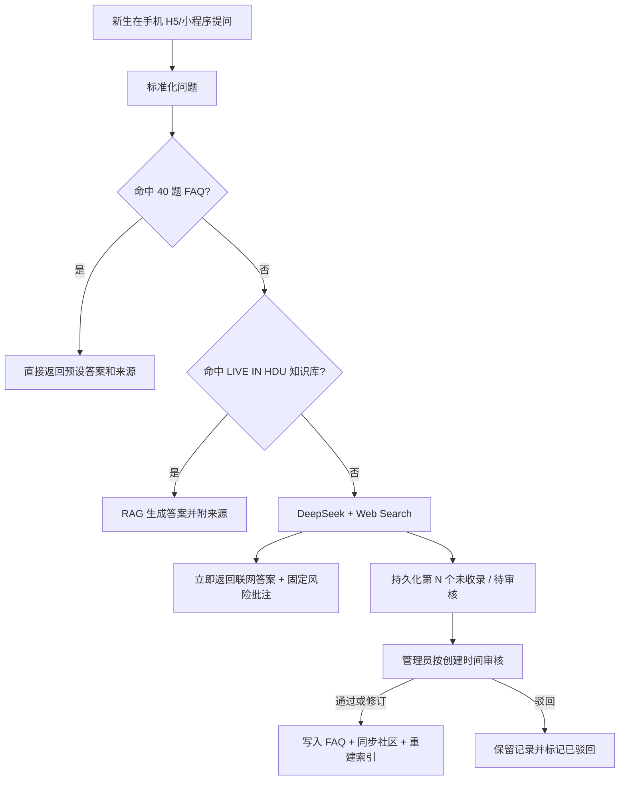

# 新生问答助手部署与复用决策

日期：2026-07-21

## 结论

首发形态采用 **手机 H5/PWA**，核心服务复用 `Tencent/WeKnora`，在它前面增加 LIVE IN HDU 专用问答网关。H5 先在微信内直接打开，不把微信小程序审核放在首发关键路径；小程序使用 WeKnora 已有 `miniprogram/` 客户端并行适配、并行送审，通过后继续复用同一套后端。

部署优先选择 **腾讯云轻量应用服务器 Lighthouse + Docker Compose + Caddy HTTPS**。WeKnora 是 Go、Web 前端、PostgreSQL、Redis 和文档解析服务组成的容器栈，适合常驻服务器，不适合第一阶段拆成云函数。CloudBase 可留作以后放纯静态入口，但不作为 WeKnora 主运行平台。

服务器地域按域名状态二选一：

1. 已有完成备案且可接入腾讯云的域名：直接使用中国大陆地域，首发 H5 和后续小程序共用 `https://ask.<已备案域名>`。
2. 没有已备案域名：先用中国香港地域发布 H5，避免把最长可达 20 个工作日的管局审核放进首发关键路径；同日启动大陆域名备案。备案完成后迁移到大陆地域。小程序正式版仍需按微信平台当时要求完成主体、类目、隐私、域名和代码审核。

不推荐把首发押在微信小程序上，也不推荐 Vercel、GitHub Pages 或纯 CloudBase 云函数：前者存在平台审核与备案依赖，后几者不能自然承载 WeKnora 的常驻多服务后端。

## 为什么选择 WeKnora

本地已固定上游提交 `150c07368b84b4f50421b8957255213cbbadc175` 到 `vendor/WeKnora/`。它已经提供 FAQ、知识库 RAG、DeepSeek、联网检索、飞书同步、网页嵌入、微信小程序和异步任务能力。项目主体为 MIT 许可，复用时保留原许可证与第三方许可。

因此第一阶段不再自行开发通用 RAG 平台，只开发 LIVE IN HDU 的业务差异：三段路由、强制风险批注、审核队列、审核回流和新生主题移动首页。

## 用户问答链路

固定批注必须逐字返回：

> 该条回复并不在我们的知识库以及 40 个预设问题中，请注意甄别

用户侧不出现“未收录”“无法回答”等拒绝性文案。“第 N 个未收录”只用于管理员审核后台。

## 审核队列与时间

- 用户回答与人工审核解耦：管理员夜间离线时，联网答案照常返回，问题照常入队。
- 默认列表严格按 `created_at ASC, ordinal ASC` 排列，从上到下显示，不因风险等级改变顺序。
- 所有第三段记录初始状态均为 `pending`，中文展示为“待审核”；不得写死当前队列数量。
- 建议运营 SLA：工作时段每 2 小时清一次队列，22:00 后的问题次日 10:00 前处理；政策、时间、费用、转专业、升学等事实敏感问题在列表中加“高风险”标识，但默认仍保持时间顺序。
- 审核通过后批量回流建议每日 12:00、20:00 两次；高风险信息只有在找到学校官方来源后才能进入知识库。

## 交付窗口

“一个半月”不是上线工期，而是产品有效期。首发目标应压缩到 **7 天内内部可用、10 天内公开 H5**；剩余时间用于补知识和运营，而不是继续搭基础设施。

| 时间 | 交付结果 |
| --- | --- |
| 第 1 天 | 云服务器、域名策略、HTTPS、WeKnora 基线启动 |
| 第 2 天 | DeepSeek、联网搜索、Embedding/Rerank 配置完成 |
| 第 3 天 | LIVE IN HDU 飞书内容首次同步并完成检索抽测 |
| 第 4 天 | 40 个预设问题导入 FAQ，确定命中阈值 |
| 第 5-6 天 | 三段路由、固定批注、持久化审核队列 |
| 第 7 天 | 管理后台审核与 FAQ/社区回流，内部灰度 |
| 第 8-9 天 | 手机 H5、来源展示、错误与超时兜底、压力测试 |
| 第 10 天 | 公开 H5；同时提交小程序版本，审核不阻塞 H5 |

## 所需工具与账号

| 类别 | 工具/账号 | 用途 |
| --- | --- | --- |
| 源码 | Git、GitHub、固定提交记录 | 复用并追踪 WeKnora 上游 |
| 本地开发 | Docker Desktop / Docker Compose、Node.js、Go | 启动 WeKnora、开发网关和前端 |
| 生产部署 | 腾讯云 Lighthouse、Ubuntu、Docker Compose、Caddy | 运行服务、HTTPS、反向代理 |
| 模型 | DeepSeek API Key、Embedding 模型、可选 Rerank 模型 | 生成、向量化和重排 |
| 搜索 | Tavily、智谱 Web Search 或自建 SearXNG，至少一主一备 | 第三段联网检索 |
| 内容 | 飞书开放平台应用或 WeKnora 飞书数据源凭证 | 同步 LIVE IN HDU |
| 小程序 | 微信小程序 AppID、微信开发者工具、已配置 HTTPS API 域名 | 并行适配和送审 |
| 监控 | Docker 日志、健康检查；后续可选 Langfuse | 错误、延迟、Token 和检索质量 |

当前这台开发机已有 Node.js，但没有 Docker；因此现在可以继续开发和测试纯前端/网关单元逻辑，不能在本机验证完整 WeKnora 容器栈。完整联调应在安装 Docker Desktop 后进行，或直接在一台临时云服务器上进行。

## 上线闸门

公开前必须同时满足：

1. 40 个预设问题各至少有 3 个表达变体通过命中测试。
2. 知识库回答显示标题、链接、更新时间和可靠等级。
3. 第三段回答 100% 带固定批注，100% 生成持久化审核记录。
4. 管理员离线测试中，连续提问仍能返回并保持 FIFO 排序。
5. DeepSeek 或主搜索商超时时，系统切到备用搜索/有限重试；所有外部依赖均失败时仍返回带风险提示的降级响应，并记录故障，不能伪造事实。
6. 管理后台和 WeKnora 管理界面不直接暴露给公网匿名用户；API Key 只保存在服务端。
7. 手机微信内完成首屏、输入、流式回答、来源跳转、弱网和重复提交测试。

## 现在需要团队提供的最小资料

- 40 个预设问题及已审核标准答案；没有它们就无法完成第一段命中验收。
- DeepSeek API Key、一个联网搜索服务 Key。
- 飞书知识库同步所需的应用凭证和访问权限。
- 域名当前备案状态、腾讯云账号主体类型。
- 若并行送审小程序：AppID、主体认证/备案状态、服务类目和隐私说明负责人。

这些凭证只能写入服务器环境变量或密钥管理，不进入仓库。
